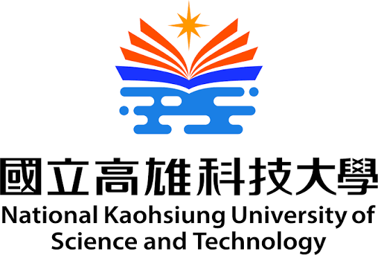

# 藍士驊

## 關於我

資管系大三社畜

### 個人技能
* **吃飯**
* 睡覺
* 喝水

> *「持續學習，不斷迷思自我。」*

### 推薦網站
~~歡迎造訪我最喜歡的開發者網站：[proHub 官網](https://github.com)~~
歡迎造訪我最喜歡的開發者網站：[GitHub 官網](https://github.com)
### 個人頭像


### 人生哲學
> 夢的翅膀
> 已經受了傷
> 我回不到有你的地方

### 工作與專案經驗

| 任務名稱 | 狀態 | 負責人 | 截止日期 |
|---|:---:|:---:|---:|
| 需求分析 | 完成 | 小翔 | 2023-01-15 |
| 資料庫設計 | 進行中 | 小驊 | 2023-01-30 |
| 前端介面 | 未開始 | 小謙 | 2023-02-15 |

### 程式碼範例

```python
print("Hello, Markdown!")
